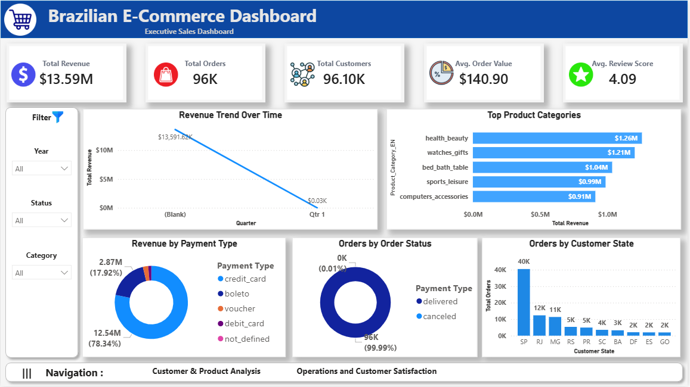
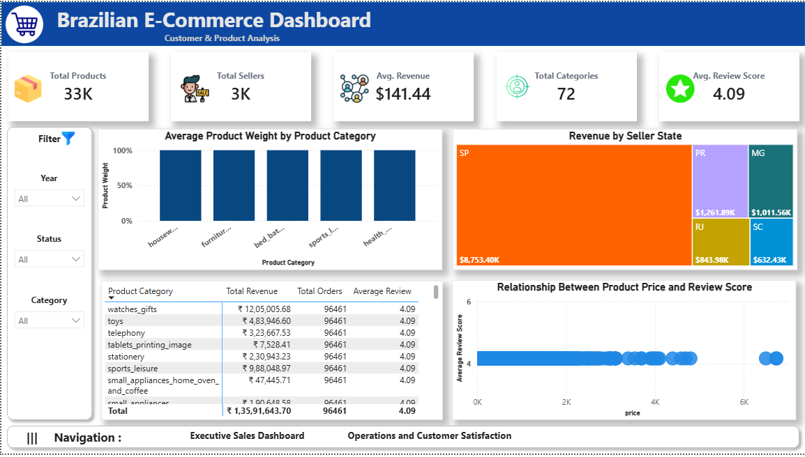
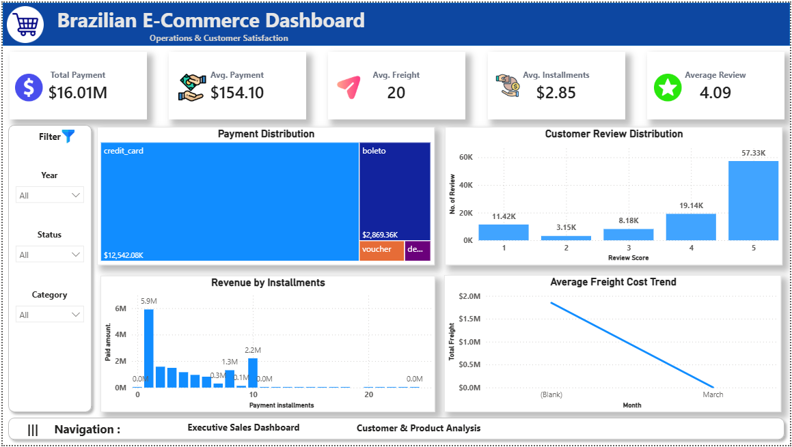
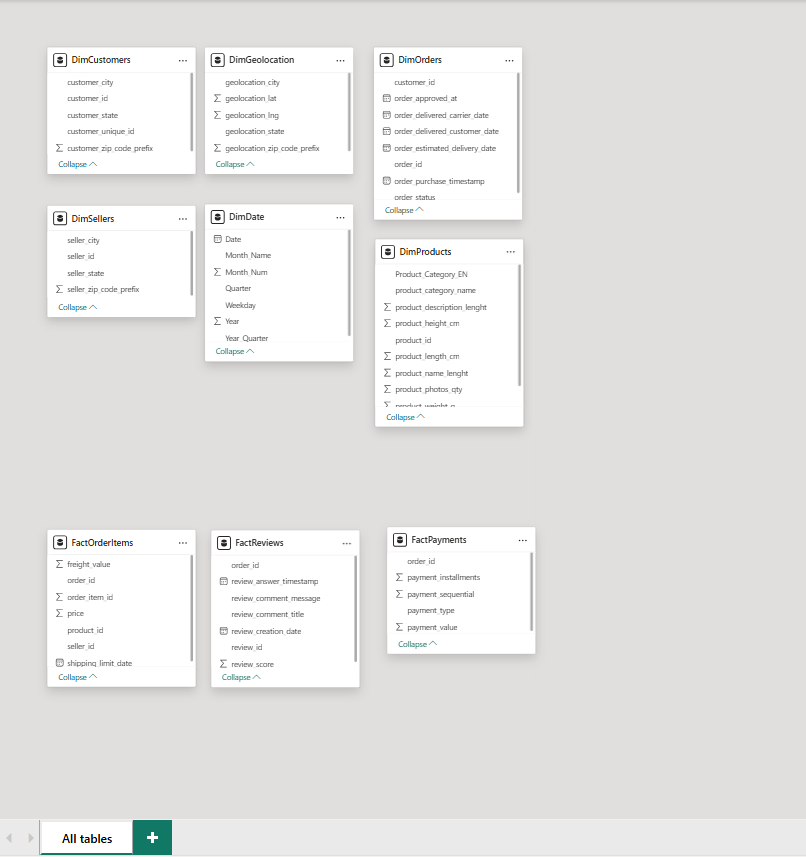
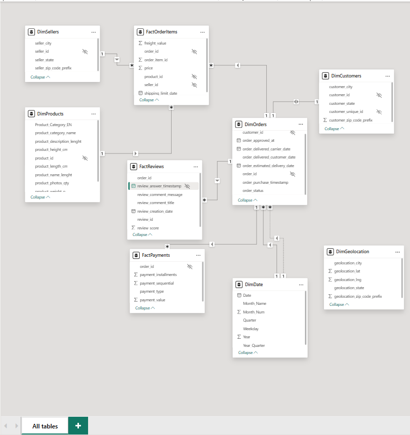

# 🇧🇷 Brazilian E-Commerce Analytics Dashboard

<p align="center">


</p>

> Executive Power BI dashboard built using the Brazilian Olist E-Commerce dataset.

## 📑 Table of Contents
- Project Overview
- Business Objectives
- Dataset
- Tech Stack
- Dashboard Pages
- Data Model
- DAX Measures
- Workflow
- Folder Structure
- Skills

---

# 🚀 Project Overview

```text
Raw CSV
   │
   ▼
Power Query
   │
   ▼
Star Schema
   │
   ▼
DAX Measures
   │
   ▼
Interactive Dashboards
```

# 🎯 Business Objectives

- Monitor sales
- Analyze customers
- Evaluate sellers
- Improve operations

# 🗂 Dataset

9 CSV files from the Brazilian Olist E-Commerce dataset.

# 🛠 Tech Stack

- Power BI
- Power Query
- DAX
- Data Modeling

# 📊 Dashboard Pages

## Executive Dashboard



## Customer & Product Analysis



## Operations & Customer Satisfaction



# 🏗 Data Model

## Initial



## Final



```text
               DimDate
                  │
DimCustomers─DimOrders─FactPayments
                  │
            FactOrderItems
             │         │
      DimProducts  DimSellers
                  │
             FactReviews
```

# 📈 Key DAX Measures

- Total Revenue
- Total Orders
- Total Customers
- Total Products
- Total Sellers
- Average Order Value
- Average Revenue Per Customer
- Average Review Score
- Average Freight
- Average Installments

# 🔄 Workflow

```text
Import → Clean → Model → DAX → Dashboard → Insights
```

# 📁 Folder Structure

```text
PR3
├── Assets
├── Datasets
├── Screenshots
├── Brazilian_E-Commerce_Public_Dashboard.pbix
└── README.md
```

# 💼 Skills Demonstrated

- Power BI
- Power Query
- DAX
- Star Schema
- Dashboard Design
- Business Intelligence

# 👨‍💻 Author

**Dushyant V**

⭐ If you like this project, consider starring the repository.
